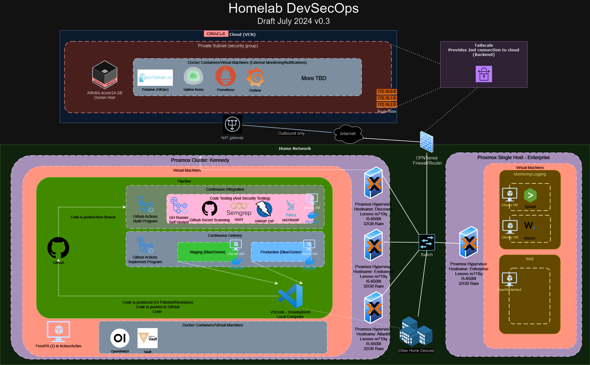

# NOTE
This project is under heavy construction as of July 2024. After a brief hiatus in the spring of 2024 due to work/life/hobby balance, I'm now resuming and making significant updates. Upcoming changes include documentation fixes, transitioning from Ansible to Terraform for Infrastructure as Code (IaC), potentially moving away from Oracle Cloud due to persistent issues, incorporating AI tools, and adding a Kubernetes cluster.

#  Project Description
Welcome to my Home Lab DevSecOps documentation! Here, I document my journey setting up a DevSecOps home lab using mostly free and open-source software. You can follow this documentation on [my personal website](https://www.initcyber.com) and my [YouTube](https://www.youtube.com/@initcyber) channel.

## Use Case
This project is designed to help aspiring cybersecurity professionals build a portfolio that demonstrates their skills. Having a home lab and relevant projects can significantly improve your chances of breaking into various cybersecurity roles such as DevSecOps, SOC, GRC, Security Engineer, and IT Security Specialist.

## How to Use This for a Cybersecurity Career
Include a "Projects" section in your resume showcasing your GitHub repository, website, and related work. Highlighting your project on platforms like [LinkedIn](https://www.linkedin.com/in/imjustinjohnson/) can also increase your visibility. 

## Updates
| Date             | Description                                                                          |
| ---------------- | ------------------------------------------------------------------------------------ |
| December 2023    | Initial Project                                                                      |
| January 2024     | Software/Hardware Changes, project rename (Homelab SOC to Homelab DevSecOps)         |
| Mid January 2024 | Added GitHub Actions workflow to upload logs to SIEM                                 |
| End January 2024 | 	Major script overhaul                                                               |
| Mid June 2024    | Homelab overhaul: Removed old node, added three new nodes, incorporated Ollama and OpenWebUI    |
| Early July 2024  | Reintroduced Terraform, replacing Ansible for IaC                                    |

## Hardware Used
For my HomeLab I am using:

 - Proxmox HA Cluster - "Kennedy"
   - 3x Lenovo m710q Ultra Small Form Factor (USFF) PCs: "Discovery", "Atlantis", "Endeavour"
	 - i5-6500T Intel CPU
	 - 32GB RAM
   - 128GB SATA SSD (Boot)
	 - 1TB NVMe (Data) 

 - NAS/Hyperconverged PC- "Enterprise"
     - i3 - 9300 Intel CPU
     - 32GB Ram
     - 512GB SSD (Boot)
     - 256GB SSD (Log Storage)

## Software Used
| Purpose                           | Software          | Link                                                      |
| --------------------------------- | ----------------- | --------------------------------------------------------- |
| Initial Code Scan                 | pre-commit        | https://pre-commit.com/                                   |
| Hypervisor                        | Proxmox           | https://www.proxmox.com/                                  |
| Containers                        | Docker            | https://www.docker.com                                    |
| Security Platform/Vuln Scanner    | Wazuh             | https://wazuh.com/                                        |
| Identity and Authentication       | FreeIPA           | https://www.freeipa.org/                                  |
| SCM                               | GitHub            | https://www.github.com/                                   |
| Secrets Storage/Cert Management   | Hashicorp Vault   | https://hashicorp.com/                                    |
| Pipeline/automation               | Github Actions    | https://docs.github.com/en/actions                        |
| SIEM/Logging                      | Splunk            | https://www.splunk.com/                                   |
| SOAR/Incident Response            | The Hive          | https://thehive-project.com/                              |
| Malware Information Sharing/OSINT | MISP              | https://www.misp-project.org/                             |
| SAST                              | Semgrep           | https://www.semgrep.dev/                                  |
| DAST                              | OWASP ZAP         | https://www.zaproxy.org/                                  |
| IAST/Runtime                      | Falco             | https://falco.org/                                        |
| Open Source Large Language Model Tool  | Ollama            | https://ollama.com/                                  |
| Web UI for Large Language Models/API's  | OpenWebUI   | https://openwebui.com/                                    |

  - More TBD

## Architecture Diagram (Ever Changing)
Last Edited: July 2024

# Implementation

#### 0 - Development Environment Files
The Development Environment folder includes a Development Container and the .pre-commit-config.yaml file. Learn more about [Dev Containers](https://code.visualstudio.com/docs/devcontainers/containers),  [Pre-Commit](https://pre-commit.com/) 

#### 1-Ansible-Infrastructure
This folder is for provisioning infrastructure using Ansible. Modify the files as needed.

#### 1.5 - Terraform-Infrastructure
This folder will soon replace the Ansible infrastructure configuration. Terraform will manage IaC, while Ansible will handle software and configuration provisioning post-Terraform application.

#### 2-Ansible-Provision
These scripts provision the VMs created by the 1.5 - Terraform-Infrastructure folder.

#### 3-Docker Containers
This folder contains docker-compose.yml scripts for various VMs.

#### 4 - Monitoring-Notifications
(TBD)

## Virtual Machine Requirements

1 - SIEM VM
 - 2 CPU Cores
 - 16 GB RAM
 - 100 GB SSD

2 - CI VM
 - 2 CPU core
 - 16 GB RAM
 - 50 GB SSD

(TBD)

# Putting it all together

Refer to the README.md files in each subfolder to run the Ansible Playbooks.

# Best Practices
Adopt a "Shift Left" security approach by empowering developers to secure their code from their development environment. Use .gitignore files and pre-commit hooks for code linting, scanning, and more.

Encourage commit signing, and using SSH for cloning/pushing repo changes. Use branches to manage code without affecting the main/master branch.

Implement Local Software Composition Analysis and Local Static Code Analysis via pre-commit hooks.

# Future Updates
(TBD)
